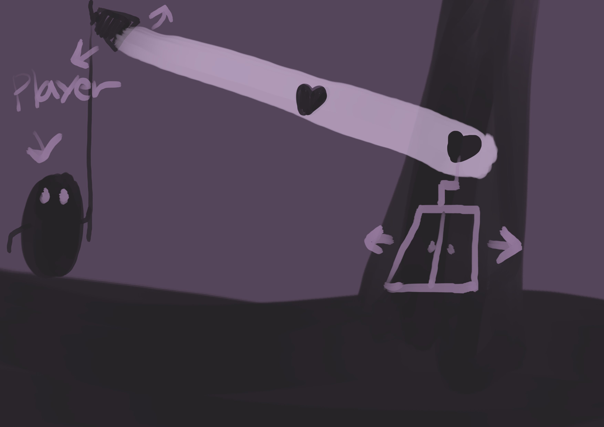

# [컨셉]
## 메인컨셉 : 빛과 그림자
- 빛으로 생기는 그림자로 인한 맵의 변화로 탐구심과 모험심을 자극하며 게임의 레벨을 조절한다.

- 장르 : 퍼즐 플렛포머, 어드벤쳐

### 서브 컨셉 1 : 그림자 퍼즐
- 빛이 없는 곳은 볼수가 없으며 빛이 닿는 물체는 그림자가 생겨 퍼즐 요소를 만든다.

### 서브 컨셉 2 : 간결하지만 아름다운 그래픽
- 빛과 그림자가 테마인 만큼 대비를 두어 간결하지만 그 대비차이로 생기는 아름다움을 강조한다.

### 서브 컨셉 3 : 탐험
- 간단한 퍼즐 요소와 기믹을 이용하여 맵을 진행한다.

### 서브 컨셉 4 : 간편한 조작
- 앞뒤 조작키와 점프키, 활성화키 이 4가지로 조작이 가능하다.

### 서브 컨셉 5 : 숨겨진 스토리
- 게임에 담겨진 스토리를 플레이어가 조금씩 알아가는 재미를 느끼게 해준다.

  
# [관련 이미지 & 동영상]
- 이미지  

- 동영상

https://www.youtube.com/watch?time_continue=29&v=L1nF4XfnJMs&feature=emb_title

  
# [대표 이미지]

  
# [컨셉 & 대표이미지 기반 작품묘사]
> ### 대표이미지 기반 :

  

# [<라이트 엔 쉐도우> 구성 요소]

 

## 1. 메커니즘

[도전 과제]
- 특정 문이나 장애물에 램프를 이용하여 물체를 비춰 그림자를 닿게하여 문이나 장애물을 치워서 다음스테이지로 넘어간다.

[재미 요소]
- 본인이 램프나 다른 사물들을 이용해 퍼즐을 해결해 나가는 재미를 느낄수 있다.
- 아기자기하고 신비한 곳을 탐험하면서 힐링을 하는 느낌을 받을수 있다. 
 

## 2. 이야기

[스토리]  
- 귀여운 요정이 유적을 탐험하는 이야기

[카메라 관점]  
- 횡스크롤

 

## 3. 미적요소

[디자인][컬러]  
- 칼라풀한 느낌보다는 빛과 그림자가 대비가 확실하게 흑백으로 표현할려고함
- 신비하지만 귀엽고 아기자기한 느낌을 주려고한다.

[음향]  
- 신비롭고 몽환적인 느낌을 나타내는 음향을 쓰려고 한다.
	
