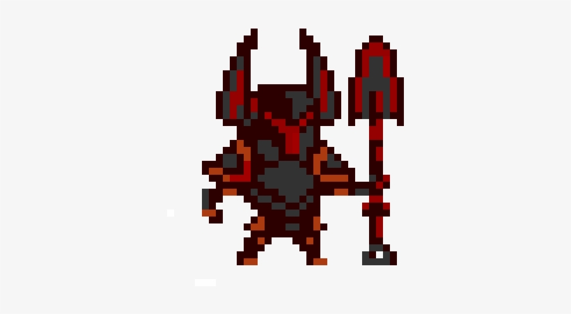
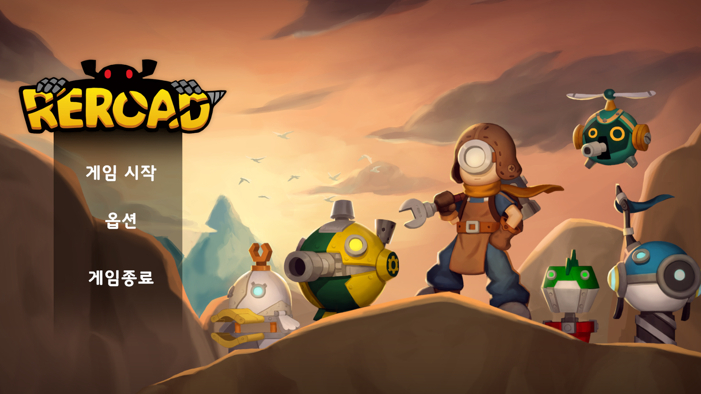
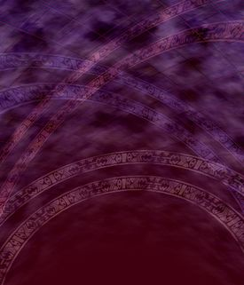
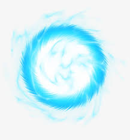
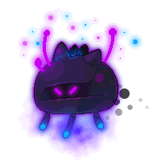
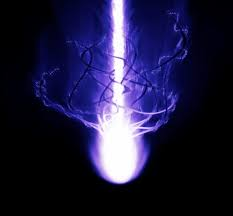

[목차]

[1.게임명 : 라이트 엔 쉐도우](#라이트-엔-쉐도우)

[2.컨셉](#컨셉)

[3.관련 이미지 & 동영상](#관련-이미지--동영상)

[4.대표 이미지](#대표-이미지)

[5.컨셉 and 대표이미지 기반 작품묘사](#컨셉--대표이미지-기반-작품묘사)

[6.라이트 엔 쉐도우 구성요소](#라이트엔-쉐도우-구성-요소)

[7.게임 시스템 디자인](#게임-시스템-디자인)

[8.개발 요구사항 & 흐름도](#개발-요구사항--흐름도)

[9.개발작업 일정(6주)](#개발작업-일정6주)

 

# [라이트 엔 쉐도우]

# [컨셉]

## 메인컨셉 : 탄막슈팅
- 플레이어가 적들의 공격을 적들의 패턴과 본인의 컨트롤을 이용하여 피하며 적을 무찌르며 앞으로 나간다.

- 장르 : 탄막슈팅

### 서브 컨셉 1 : 판타지적 요소
- 판타지적 스토리와 동양풍의 배경이 게임을 다채롭고 흥미롭게 만들어준다.

### 서브 컨셉 2 : 아기자기한 그래픽
- 아기자기 하지만 배경과 플레이어 적이 잘 구별이되는 가시성있는 그래픽을 강조한다.

### 서브 컨셉 3 : 쉽게접할수 있는 게임성
- 게임을 별로 하지않거나 안해본 사람도 쉽게 이해할수있어 접근성이 높다.

### 서브 컨셉 4 : 간편한 조작
- 게임의 익숙해 지기 쉽고 적은 조작키만 사용해도 게임을 즐길수있다.

### 서브 컨셉 5 : 긴장감
- 매 순간 긴장을 놓질수없어 게임의 재미를 올려준다.
  
# [관련 이미지 & 동영상]
- 이미지  

- 동영상

https://www.youtube.com/watch?v=tj-feoNHiQI

  
# [대표 이미지]

  

# [컨셉 & 대표이미지 기반 작품묘사]
> ### 대표이미지 기반 :

  

# [<라이트엔 쉐도우> 구성 요소]

 

## 1. 메커니즘

[도전 과제]
- 적들의 공격을 피하면서 적을 무찌르며 앞으로 나아가 최종적으로 보스를 물리치면 스테이지가 클리어 된다.

[재미 요소]
- 탄막을 피하는 재미와 적절한 긴장감을 더하면서
아기자기하고 신비한 곳을 플레이하면서 모험을 하는 느낌을 받을수 있다.
 

## 2. 이야기

[스토리]  
- 빛의 전사가 그림자 괴물들을 물리치는 이야기

 

## 3. 미적요소

[카메라]  
- 탑뷰형식으로 우리가 흔히 알고있는 탄막슈팅의 기본시점이다.

[디자인][컬러]  
- 칼라풀한 느낌과 신비하면서 귀엽고 아기자기한 동양풍 느낌을 주려고한다.

[음향]  
- 신비롭고 몽환적인 느낌을 나타내는 음향을 쓰려고 한다.
	
## 4. 기술

[제작툴] 
- 유니티 엔진

# [게임 시스템 디자인]
## 1. 게임 오브젝트 분해

|연번|오브젝트 이름|오브젝트 이미지|
|------|---|---|
|1|플레이어||
|2|로비화면||
|3|필드화면||
|4|캐릭터의 탄||
|5|적||
|6|적의 탄||
 

## 2. 파라미터(속성) 뽑아 보기
- 1.플레이어

|속성|영문명칭|설명|
|------|---|---|
|체력|Health|플레이어의 체력이며 체력이 사라지면 목숨이 깎인다.|
|목숨|Life|목숨이 있으면 플레이어는 부활하고 목숨이 없다면 게임오버 된다.|
|탄 쏘기|Shoot|플레이어의 탄을 쏜다.|
|이동|Move|플레이어는 이동할수 있다.|
|폭탄|Bomb|폭탄게이지를 소모해 필드의 탄막을 전부 지워준다.|

- 2.로비화면

|속성|영문명칭|설명|
|------|---|---|
|시작하기|Start|게임을 시작한다.|
|종료하기|End|게임을 종료한다.|

- 3.필드화면

|속성|영문명칭|설명|
|------|---|---|
|배경|Back Ground|게임의 배경이다.|

- 4.플레이어의 탄

|속성|영문명칭|설명|
|------|---|---|
|속도|Speed|플레이어의 탄의 속도이다.|
|방향|Direction|플레이어 탄의 방향(앞) 이다.|

- 5.적

|속성|영문명칭|설명|
|------|---|---|
|체력|Health|적의 체력이며 체력이 다 깎이면 사망한다.|
|이동|Move|적은 이동하거나 멈춘다.|

- 6.적의 탄

|속성|영문명칭|설명|  
|------|---|---|  
|속도|Speed|적의 탄의 속도이다.|  
|방향|Direction|적의 탄의 방향이다.|  
|추적|Tracking|적의 탄은 플레이어를 추적한다.|  

 

## 3. 행동 뽑아 보기
- 1.플레이어

|행동|설명|
|------|---|
|이동|방향키 위,아래,오른쪽,왼쪽으로 이동한다.|
|탄 쏘기|버튼을 누르면 탄을 쏜다.|
|폭탄 발동|버튼을 누르면 폭탄이 발동된다.|
|적의 탄을 맞으면 사망|적의 탄을 맞으면 게임에서 사라지고 목숨을 하나 깎는다.|
|목숨이 있으면 부활|목숨이 있으면 게임에 다시 참여한다.|
|목숨이 없으면 게임오버|목숨이 없으면 게임오버가 된다.|

- 2.플레이어의 탄

|행동|설명|
|------|---|
|앞으로 쭉 나간다|플레이어의 탄쏘기 버튼으로 생성된 탄은 앞으로 쭉 나간다.|

- 3.적

|행동|설명|
|------|---|
|플레이어의 탄을 맞으면 체력이 담|플레이어의 탄을 맞으면 체력이 단다.|
|체력이 다달면 사망한다|체력이 0이되면 게임에서 사라진다.|
|적의 탄을 쏜다|적은 일정시간마다 적의 탄을 쏜다.|

- 4.적의 탄

|행동|설명|
|------|---|
|앞으로 쭉나간다|적에서 생성된 적의 타은 앞으로 쭉나간다.|
|대각선으로 나간다|적에서 생성된 적의 타은 대각선으로 쭉나간다.|
|느리게 적을 추적한다|적에서 생성된 적의 타은 플레이어를 느리게 추적한다.|
 

## 4. 상태 뽑아 보기

- 1.플레이어

|현상태|전이상태|전이조건|
|------|---|---|
|기본 상태|사망 상태|플레이어가 적의 탄을 맞아 체력이 0이 된다.|
|사망 상태|기본 상태|목숨이 있을경우 1 깍고 기본상태가 된다.|

- 2.적

|현상태|전이상태|전이조건|
|------|---|---|
|기본 상태|사망 상태|플레이어의 탄을 맞고 체력이 0이 된다.|
|사망 상태|피격 상태|플레이어의 탄을 맞는다.|

 

## 5. 플레이어 캐릭터 속성(파라미터)
|속성|영문명칭|설명|
|------|---|---|
|체력|Health|플레이어의 체력을 나타내며 1로 고정이다.|
|탄쏘기|Shoot|플레이어의 탄을 만드는 만든다.|
|목숨|Life|플레이어의 체력이 0이 되면 깍이며 게임 부활의 여부를 정한다.|
|이동|Move|플레이어의 이동속도와 방향을 정한다.|
 

## 6. 게임의 규칙

- 플레이어는 적들의 탄을 피하고 자신의 탄으로 적을 물리치고 앞으로 나아간다.
- 플레이어는 적들의 탄 한발을 맞으면 사망하며 목숨이 있을시 부활하고 없을시 게임이 오버된다.
- 적들은 플레이어의 탄을 맞으면 체력이 깍이고 체력이 다달면 사라진다.
- 스테이지 끝 보스를 물리치면 스테이지를 클리어하고 다음 스테이지로 넘어간다.

 

## 7. 게임에서 사용될 공식

- 플레이어가 적의 탄을 맞으면 체력이 1달며 체력이 1인 플레이어는 사망하며
목숨이 있을시 부활하며 목숨이 0이되면 게임오버가 된다.

- 적들은 각자 다른 체력을 가지고있으며 데미지 1인 플레이어의 탄에 맞아 체력이 0이 되면 사라진다.

 

# [개발 요구사항 & 흐름도]
## 1. 요구사항

6주/
- 로비에는 게임시작.게임종료 버튼이있다.
- 게임시작을 누르면 게임화면으로 넘어간다.
- 게임화면은 플레이어, 적, 배경, 점수판, 목숨갯수, 폭탄갯수가 표시된다.
- 플레이어는 키포드 화살표로 이동하며 스페이바로 공격 X키로 폭탄을 사용한다.
- 플레이어가 공격하면 탄이 나가며 탄이 적에게 맞을경우 탄은 사라지며 적들은 데미지를 입는다.
- 적은 출현한후 이동하거나 정지한후 탄을 쏜다.
- 적의 탄에 플레이어가 맞으면 사망한다.
- 폭탄을 소비하면 맵에있는 적의탄막을 전부 제거한다.
- 플레이어가 사망한후 목숨이 있다면 목숨을 소비하고 부활한다.
- 플레이어가 사망한후 목숨이 없다면 게임오버가 된다.
- 적을 물리치면 적당 가지고 있는 점수치 만큼 점수가 올라간다.
- 스테이지 끝에 보스가 있으며 보스를 물리치면 다음스테이지로 넘어가거나 게임을 클리어 하기된다.

1년/
- 스토리 컷씬과 대화창으로 게임의 스토리를 보여준다.
- 보스가 나오면 특정 대사나 행동을 추가적으로 보여준다.
- 적에게서 아이템이 떨어지며 아이템을 주우면 플레이어의 공격이 강해진다.
- 플레이어 캐릭터가 1명이 아닌 다수이다.
- 지금까지 깬 스테이지에서 다시 시작할수있게 한다.

 

## 2. 키보드 이벤트에 대한 흐름도

 

## 3. 용어정리

 

# [개발작업 일정(6주)]

 
 - 1주차는 타이틀 메뉴화면을 구현함과 동시에 스토리와 컨셉을 짠다.

- 2주차는 스토리를 다듬으며 맵을 구현함과 맵 그래픽 작업을 한다.

- 3주차는 플레이어의 구현과 플레이어의 그래픽, 동작, 탄쏘기 등을 구현함과 동시에 플레이어에 맞춰 적의 그래픽을 같이 작업한다.

- 4주차는 적과 적의 핵심인 패턴구현 과 3주차의 플레이어, 적의 그래픽을 계속 다듬고 그리고 부가적으로 필요한 오브젝트를 만든다.

- 5주차는 미구현 된 3,4주차를 정리하며 구현하고 UI의 구현과 지금까지의 디자인에 맞추어 UI 그래픽 작업을 한다.

- 6주차는 마지막 단계인 만큼 그래픽을 한번씩 더 손보고 5주차에 구현하는 것을 마무리한다음 사운드를 입히고 동영상제작을 하여 마무리 한다.
